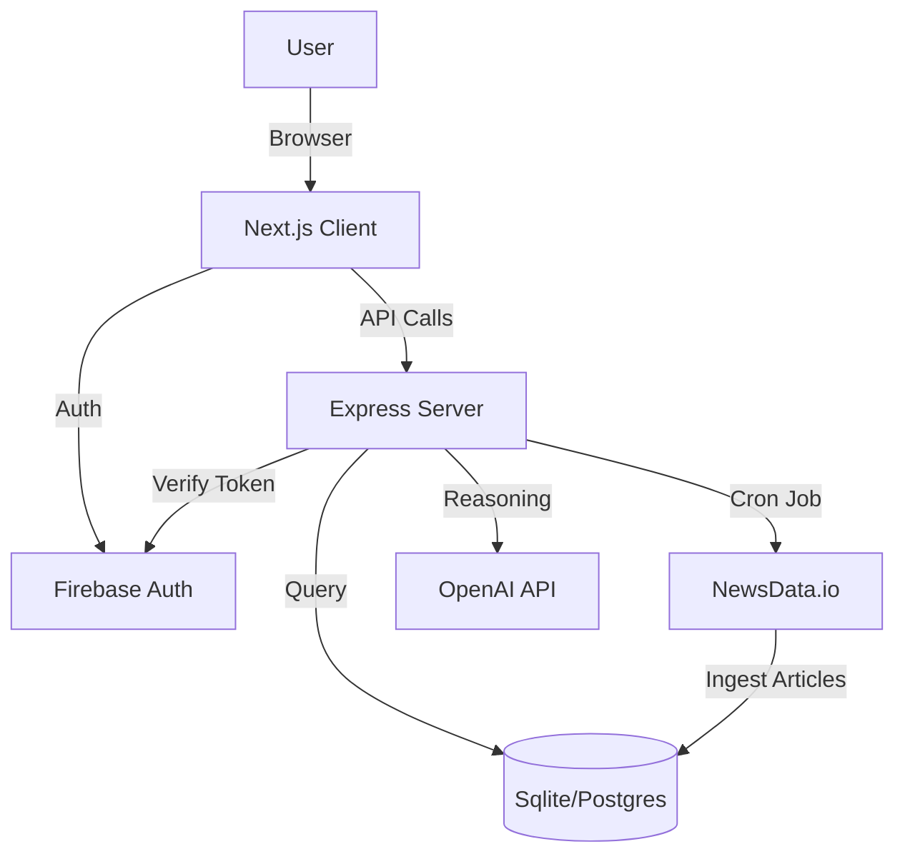

# NewsAXE 🚀
> *The Future of Real-Time, AI-Powered News Aggregation.*


## 📌 Overview
NewsAXE is a **senior-level, full-stack news platform** designed to deliver breaking news with zero latency. Unlike traditional aggregators, NewsAXE employs a **hybrid architecture** that fuses a local content database with a real-time external API ingestion engine, orchestrating a seamless reading experience.

Empowered by an **Agentic AI Chatbot**, users can converse with their news feed, asking complex questions like *"What happened in the global water summit?"* and receiving synthesized answers derived from live data.

## ✨ Key Features

### 🧠 Intelligent Core
- **Agentic Chatbot**: Built with OpenAI Function Calling. The AI autonomously decides when to query the internal news database to verify facts or fetch the latest updates.
- **Auto-Summarization**: (Coming Soon) One-click TL;DRs for long-form articles.

### ⚡ High-Performance Architecture
- **Hybrid News Feed**: Merges highly-optimized local articles (ISR cached) with live API results (`newsdata.io`) for the perfect balance of speed and freshness.
- **Real-Time Ingestion Engine**: A background **Cron Job** runs every 30 minutes, scraping global headlines across 6 major categories and syncing them to the database with intelligent de-duplication.
- **Edge Caching**: Utilizes Next.js `revalidate` strategies to serve Category pages in milliseconds while keeping content fresh.

### 🛡️ Enterprise-Grade Security
- **Firebase Authentication**: Secure Google Sign-In flow with backend token verification (`firebase-admin`).
- **Rate Limiting**: Backend is protected by `express-rate-limit` (100 req/15min) to prevent abuse.
- **Dockerized**: specific `Dockerfile` and `docker-compose.yml` for instant, consistent deployment anywhere.

## 🛠️ Technology Stack

| Component | Tech Choice | Rationale |
|-----------|-------------|-----------|
| **Frontend** | Next.js 15 (App Router) | Server Components for SEO, ISR for performance. |
| **Backend** | Express.js + TypeScript | Robust, type-safe REST API with flexible middleware. |
| **Database** | SQLite (Dev) / Postgres (Prod) | Relational data integrity via Prisma ORM. |
| **Auth** | Firebase Auth + JWT | Best-in-class identity management synced with local session. |
| **AI** | OpenAI GPT-4o | State-of-the-art reasoning for the news assistant. |
| **Styling** | Tailwind CSS + Framer Motion | Modern, responsive, and animated UI. |

## 🏗️ Architecture


## 🚀 Getting Started

### Prerequisites
- Node.js 18+
- Docker (Optional)
- API Keys: `NewsData.io`, `OpenAI`, `Firebase`

### Installation

1. **Clone the repository**
   ```bash
   git clone https://github.com/yourusername/newsaxe.git
   cd newsaxe
   ```

2. **Setup Frontend**
   ```bash
   npm install
   cp .env.example .env.local # Configure Firebase keys
   npm run dev
   ```

3. **Setup Backend**
   ```bash
   cd backend
   npm install
   cp .env.example .env # Configure API Keys & Database
   npx prisma db push
   npx prisma db seed
   npm run dev
   ```

4. **Run via Docker (One Command)**
   ```bash
   docker-compose up --build
   ```

## 🧪 Testing
*(Recommended)* 
Run backend tests to verify API integrity:
```bash
cd backend && npm test
```

## 👨‍💻 Author
**Ansh** - *Full Stack Engineer*

---
*Built with ❤️ for a better news experience.*
